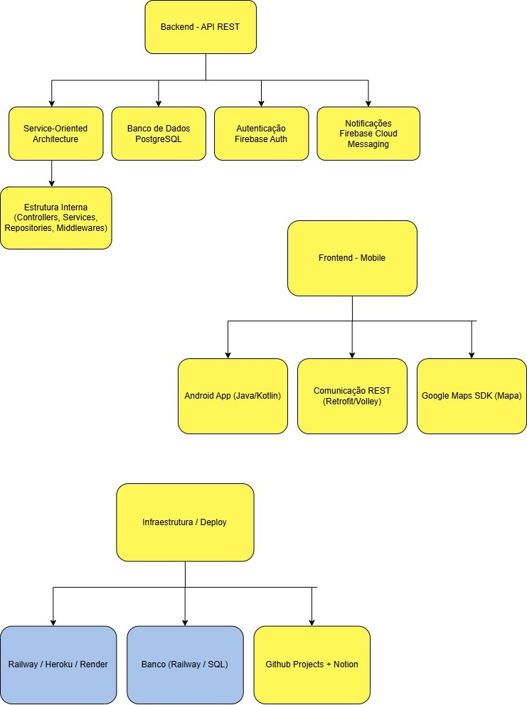
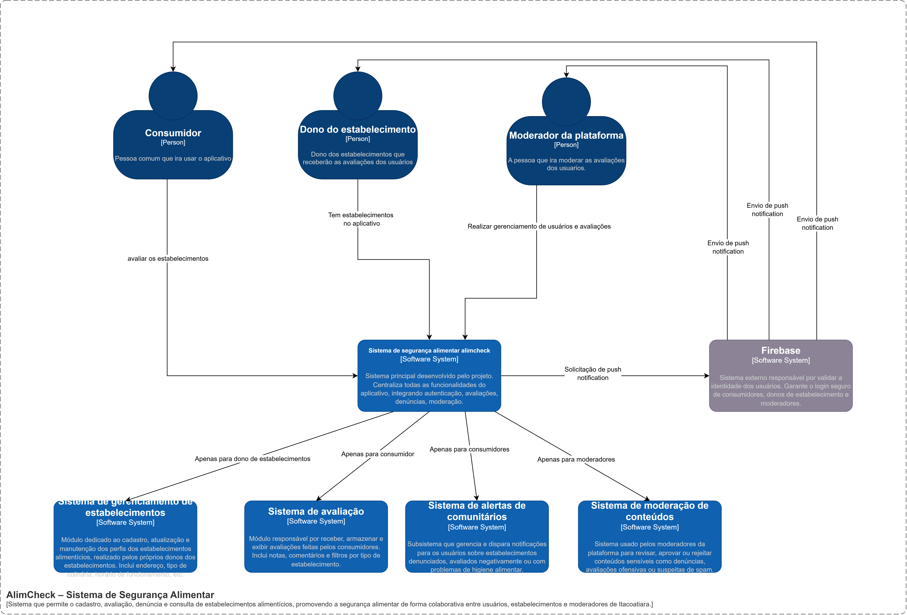
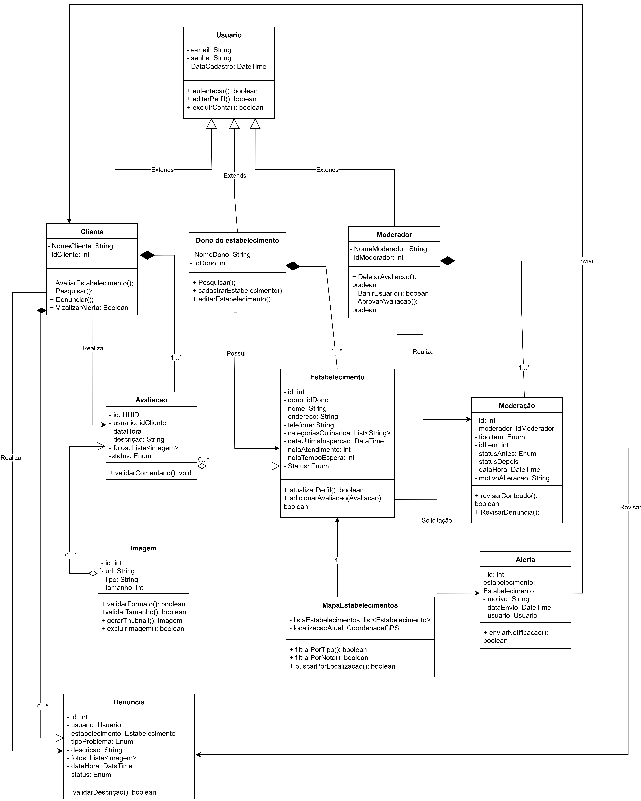

# Escolha do Padrão Arquitetural

| **Padrão Arquitetural** | **Justificativa** |
|----------------------|-------------------------------|
| **Cliente/Servidor (REST)** | O sistema segue uma arquitetura baseada em comunicação via API REST, onde o cliente (aplicativo Android) consome recursos expostos pelo servidor backend. Isso garante uma separação clara entre frontend (App Android) e backend (API REST), com protocolos HTTP para comunicação.

# Tech Stack Map

| **Camada** | **Tecnologia** | **Justificativa** |
|------------|-----------------|-------------------|
| **Backend** | Node.js + Express | Tecnologias leves e com grande comunidade para construção rápida de APIs REST. Fácil integração com banco de dados e serviços externos como Firebase. |
| **Frontend** | Android (Java/Kotlin), Google Maps SDK, Retrofit/Volley | 	**Java/Kotlin**: Linguagens padrão para desenvolvimento Android nativo. **Google Maps SDK**: Necessário para exibir localização dos estabelecimentos. **Retrofit/Volley**: Bibliotecas populares para consumir APIs REST de forma eficiente. |
| **Banco de Dados** | PostgreSQL (Railway) | Banco de dados relacional robusto, de código aberto, com suporte a consultas complexas e alta escalabilidade. |
| **Autenticação** | Firebase Authentication | Solução pronta para autenticação com suporte a login por email, senha e redes sociais. Reduz complexidade no backend. |
| **Notificações Push** | Firebase Cloud Messaging | Plataforma gratuita e confiável para envio de notificações push para dispositivos Android. |
| **Infraestrutura / Deploy** | Railway / Render / Heroku | Plataformas simples e gratuitas (com planos de estudante) para deploy rápido de aplicações Node.js e bancos de dados PostgreSQL. |
| **Gerenciamento de Projeto** | GitHub Projects + Notion | Para organizar tarefas de desenvolvimento. Notion: Para documentação interna e acompanhamento de progresso. |

# Modelo C4 

## Diagrama de Contexto

## Diagrama de Conteiners

## Diagrama de Componentes

## Diagrama UML

# Rastreabilidade com Histórias de Usuários

| **História de Usuário** | **Componentes Envolvidos** | **Diagramas de Referência** |
|-------------------------|----------------------------|-----------------------------|
| H1 - Avaliar estabelecimentos | ReviewController, ReviewService, ModerationService, PostgreSQL | Contexto, Containers, Componentes, Código |
| H2 - Consultar avaliações e dados de higiene | EstablishmentController, ReviewController, SanitaryInspectionService, PostgreSQL | Contexto, Containers, Componentes, Código |
| H3 - Registrar denúncias | AlertController, AlertService, ModerationService, PostgreSQL | Contexto, Containers, Componentes, Código |
| H5 - Receber alertas de locais com problemas | NotificationService, AlertService, Firebase Cloud Messaging, PostgreSQL | Contexto, Containers, Componentes, Código |
| H6 - Receber recomendações personalizadas | RecommendationService, UserService, ReviewService, PostgreSQL | Contexto, Containers, Componentes, Código |
| H9 - Excluir minha conta | UserController, UserService, Firebase Auth, PostgreSQL | Contexto, Containers, Componentes, Código |
| H10 - Ver mapa com estabelecimentos | EstablishmentController, LocationService, Google Maps SDK, PostgreSQL | Contexto, Containers, Componentes, Código |
| H11 - Filtrar estabelecimentos | EstablishmentController, FilterService, PostgreSQL | Contexto, Containers, Componentes, Código |
| H12 - Atualizar perfil do estabelecimento | EstablishmentController, EstablishmentService, PostgreSQL | Contexto, Containers, Componentes, Código |
| H14 - Cadastrar estabelecimento | EstablishmentController, EstablishmentService, PostgreSQL | Contexto, Containers, Componentes, Código |
| H15 - Moderação de relatos de usuários | ModerationController, ModerationService, PostgreSQL | Contexto, Containers, Componentes, Código |
| H16 - Histórico de ações de usuários | UserActivityService, ModerationPanel, PostgreSQL | Contexto, Containers, Componentes, Código |
