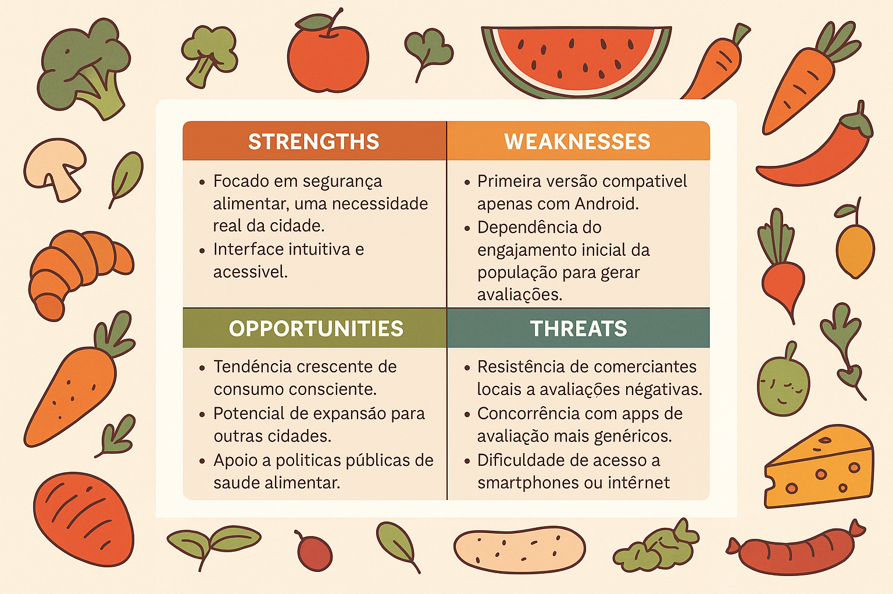

# Por quê?
A população de Itacoatiara enfrenta dificuldades para identificar estabelecimentos alimentícios que realmente sigam boas práticas de higiene e qualidade. Muitos consumidores estão expostos a riscos como alimentos vencidos, contaminações e condições sanitárias precárias. O projeto busca empoderar a comunidade local, promovendo a segurança alimentar através da informação e da colaboração entre os moradores.
# Como?
O aplicativo será uma plataforma colaborativa onde os próprios cidadãos poderão avaliar, comentar e alertar sobre a qualidade dos alimentos e estabelecimentos. A solução será inovadora por usar a força da comunidade para gerar informações confiáveis, sem depender exclusivamente da fiscalização oficial. Além disso, terá uma interface acessível, adaptada para todos os perfis de usuários, mesmo aqueles com pouca familiaridade digital.
# O quê?
Será desenvolvido um aplicativo mobile para Android que:
- Permite cadastrar e consultar estabelecimentos locais;
- Permite avaliar locais com notas e comentários;
- Exibe alertas comunitários sobre problemas de higiene, validade e atentimento;
- Disponibiliza filtros de busca por tipo de local, nota e localização.
---
# Matriz SWOT:
| **Fatores Internos** | **Pontos Fortes (Strengths)** | **Pontos Fracos (Weaknesses)** |
|----------------------|-------------------------------|---------------------------------|
| **Recursos e Capacidades** | - Aplicativo focado em segurança alimentar, uma necessidade real da cidade. - Interface intuitiva e acessível. - Envolvimento direto da comunidade local. | - Primeira versão compatível apenas com Android. - Dependência do engajamento inicial da população para gerar avaliações. |
| **Organização e Processos** | - Uso de metodologia ágil (Scrum) para desenvolvimento. - Equipe multidisciplinar bem definida (devs, design, PO, Scrum Master, documentação). | - Equipe pequena, o que pode limitar o volume de funcionalidades no MVP. - Tempo limitado para desenvolvimento acadêmico. |

| **Fatores Externos** | **Oportunidades (Opportunities)** | **Ameaças (Threats)** |
|----------------------|-----------------------------------|------------------------|
| **Ambiente e Mercado** | - Tendência crescente de uso de aplicativos para consumo consciente. - Potencial de expansão para outras cidades. - Apoio a políticas públicas de saúde alimentar. | - Resistência de comerciantes locais a avaliações negativas. - Concorrência com apps de avaliação mais genéricos (ex: Google Maps, TripAdvisor). - Dificuldade de acesso a smartphones ou internet por parte da população. |

# Identificação Visual de Soluções Existentes

### Aplicativo: TripAdvisor
**Descrição:** Plataforma online para avaliação de experiências em restaurantes, hotéis e atrações turísticas, com base em comentários de usuários.  
**Público-alvo:** Turistas e consumidores que buscam experiências gastronômicas confiáveis.

---

### Aplicativo: Google Maps  
**Descrição:** Ferramenta de localização com sistema integrado de avaliações de estabelecimentos, incluindo comentários sobre higiene, atendimento e qualidade dos alimentos.  
**Público-alvo:** Usuários gerais que procuram restaurantes e serviços locais com base em localização e reputação.

---

### Aplicativo: Yelp  
**Descrição:** Plataforma de avaliação colaborativa para negócios locais, com foco em bares, cafés e restaurantes, permitindo comentários detalhados e fotos.  
**Público-alvo:** Consumidores urbanos que valorizam opiniões da comunidade antes de visitar restaurantes.

---

### Aplicativo: iFood  
**Descrição:** Aplicativo de entrega de comida que permite aos usuários avaliar restaurantes com base na qualidade da comida, tempo de entrega e higiene.  
**Público-alvo:** Usuários que preferem refeições por delivery e desejam confiar nas avaliações antes de realizar um pedido.

---

# Quadro Comparativo de Soluções Existentes

| Critério | TripAdvisor | Google Maps | Yelp | iFood | Nossa solução |
| --- | --- | --- | --- | --- | --- |
| **Modelo de Negócio** | Baseado em publicidade (anúncios de restaurantes), comissionamento por cliques em reservas e assinatura premium (TripAdvisor Plus) para descontos. | Gratuito para usuários, com receita via anúncios no Google Ads e parcerias com estabelecimentos para destaque no mapa. | Baseado em publicidade para negócios locais e serviços premium para proprietários (Yelp Ads, ferramentas de gestão). | Comissionamento (20-30% por pedido) cobrado de restaurantes, além de taxas de entrega para usuários. | Gratuito, sem fins lucrativos, focado em impacto social e comunitário. Financiamento inicial próprio, com possibilidade de parcerias locais ou licenciamento open-source no futuro. |
| **Tecnologia Utilizada** | Plataforma web e mobile (iOS, Android), com IA para recomendações personalizadas, moderação de avaliações com algoritmos antifraude e big data para análise de preferências. | Plataforma web e mobile, com integração de mapas (Google Earth), IA para sugestões de locais, GPS e análise de dados de usuários. | Plataforma web e mobile, com algoritmos de busca e recomendação, moderação de avaliações e integração com redes sociais. | Plataforma web e mobile, com sistemas de geolocalização, IA para personalização de pedidos e logística de entrega otimizada. | Aplicativo mobile para Android. |
| **Público-alvo** | Viajantes globais e consumidores locais que buscam avaliações confiáveis de restaurantes, com acesso à internet e interesse em planejamento detalhado. | Usuários globais de smartphones, incluindo consumidores locais e turistas, com diferentes níveis de familiaridade digital, que buscam informações rápidas. | Consumidores urbanos que buscam recomendações detalhadas sobre restaurantes e serviços locais, com familiaridade digital. | Consumidores urbanos, jovens e famílias que buscam conveniência em pedidos de alimentos, com acesso à internet. | Consumidores, residentes em Itacoatiara-AM, de diferentes idades e níveis de familiaridade digital, que buscam informações confiáveis sobre a qualidade e higiene de estabelecimentos alimentícios locais (feiras, restaurantes, comércios). |
| **Pontos Fortes** | - Maior banco de avaliações de restaurantes (860M+ globalmente). - Filtros avançados (tipo de cozinha, preço, localização). - Credibilidade em avaliações detalhadas. - Interface acessível para usuários com pouca experiência digital. | - Integração com mapas e GPS, ideal para localização em tempo real. - Amplo alcance global, acessível em Itacoatiara. - Interface simples e inclusiva. - Avaliações de ampla base de usuários. | - Foco em avaliações detalhadas e confiáveis. - Filtros de busca robustos (nota, distância, tipo de negócio). - Comunidade engajada de avaliadores. - Moderação rigorosa de avaliações. | - Integração com pedidos e entregas, aumentando engajamento. - Interface intuitiva e rápida. - Avaliações focadas em qualidade de alimentos e atendimento. - Forte presença no Brasil. | - Foco específico em segurança alimentar e higiene de estabelecimentos. - Interface simplificada para usuários com pouca familiaridade digital. - Avaliações colaborativas com alertas comunitários. - Funcionalidades offline para áreas com internet limitada. - Impacto social direto na comunidade local. |
| **Pontos Fracos/Limitações** | - Foco em turismo, menos adaptado para comunidades locais como Itacoatiara. - Vulnerabilidade a avaliações falsas, apesar de moderação. - Menor penetração em áreas rurais. | - Avaliações menos detalhadas e mais genéricas. - Dependência de conexão à internet para mapas. - Menor foco em higiene alimentar. - Moderação menos rigorosa que TripAdvisor/Yelp. | - Menor presença no Brasil, especialmente em cidades menores como Itacoatiara. - Interface menos acessível para usuários com baixa familiaridade digital. - Foco em áreas urbanas. | - Foco em delivery, com menos ênfase em avaliações de higiene. - Dependência de restaurantes parceiros, limitando cobertura. - Taxas podem desincentivar pequenos estabelecimentos. | - Escopo inicial limitado a Itacoatiara, sem alcance nacional. - Dependência de adoção pela comunidade local para sucesso. - Recursos limitados por ser um projeto independente. - Primeira versão apenas para Android, excluindo outros sistemas e versão web. |
