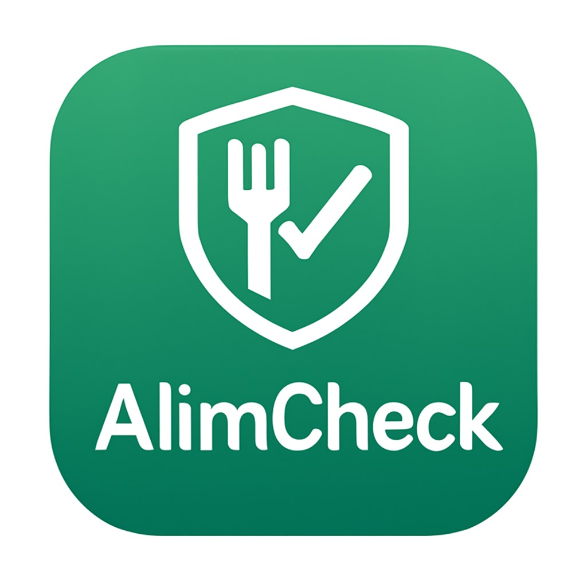
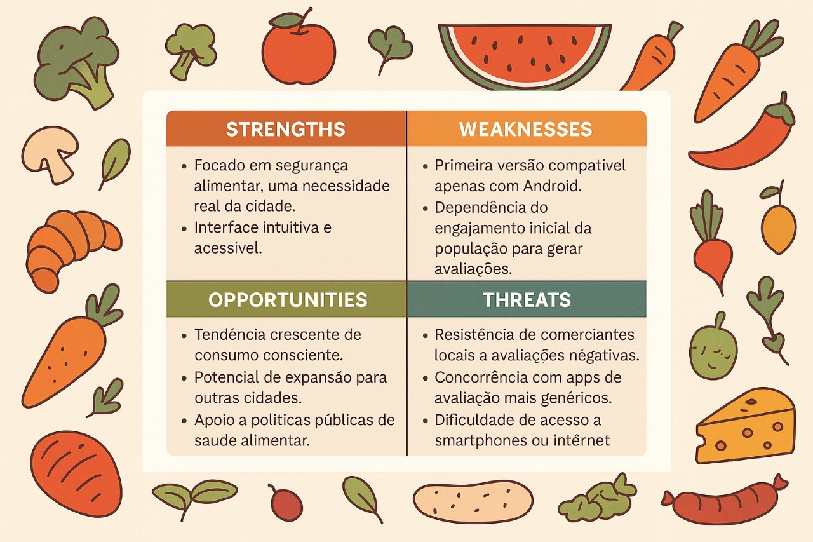
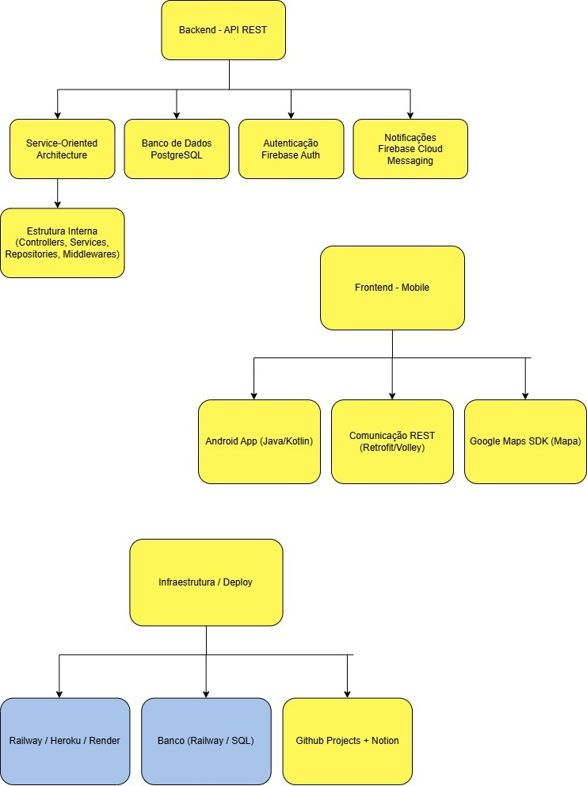
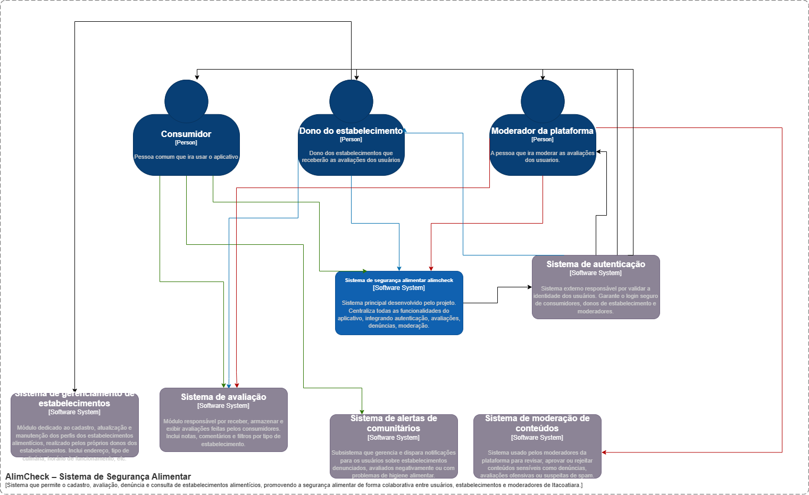
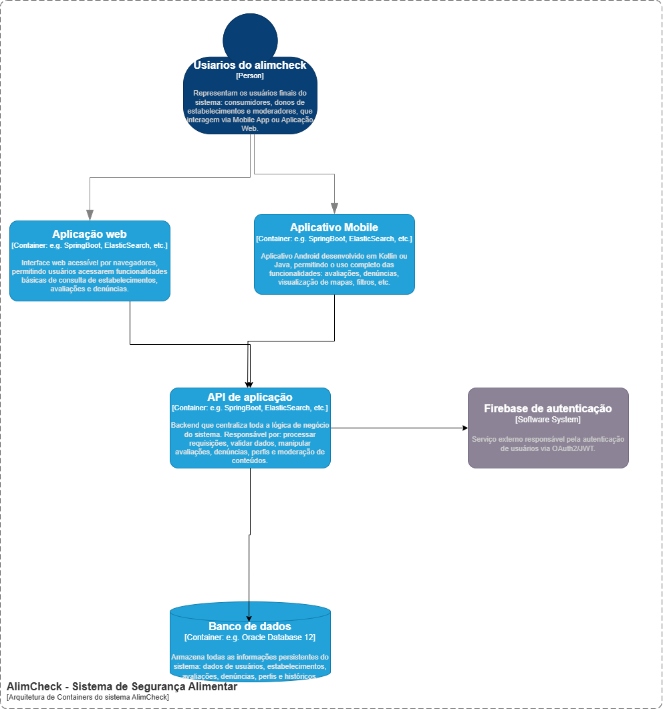
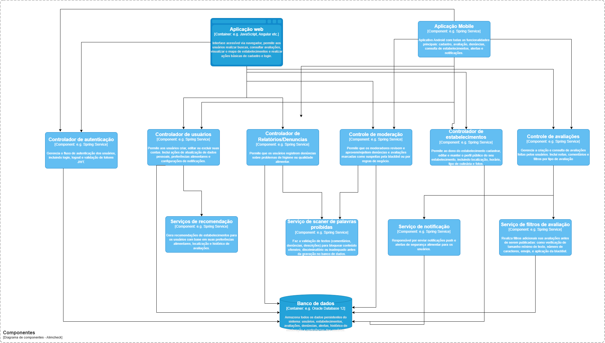
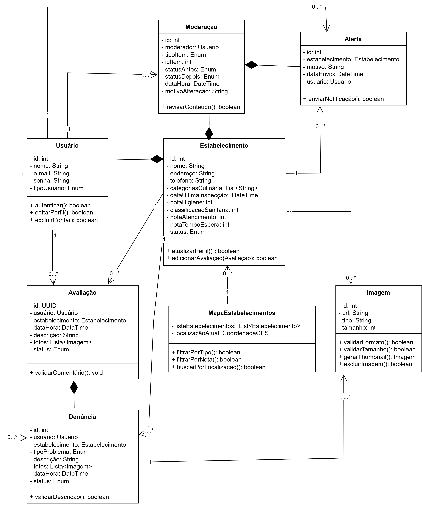

# Projeto Foodiscan / AlimCheck

  

---

## 📖 1. Introdução ao Projeto

Esta seção apresenta o contexto geral do projeto. Nosso aplicativo surgiu da necessidade de resolver um problema real em Itacoatiara-AM: a falta de informações confiáveis sobre a higiene e a qualidade dos alimentos nos estabelecimentos locais.

### 📌 Problema
Consumidores da cidade enfrentam dificuldades para saber quais estabelecimentos seguem boas práticas sanitárias. Isso pode causar riscos à saúde pública.

### 🎯 Objetivo Geral
Desenvolver um aplicativo Android que permita aos moradores:

- Avaliar estabelecimentos
- Denunciar problemas de higiene
- Consultar a reputação de locais de venda de alimentos

### 👥 Público-Alvo
Moradores de Itacoatiara-AM, de todas as idades, com diferentes níveis de familiaridade digital.

---

## 💡 2. Ideação e Design Thinking

Nesta parte, explicamos como a ideia foi desenvolvida usando métodos de **Design Thinking**, incluindo ferramentas de ideação e análise.

### 🔍 Golden Circle
- **Por quê?** Melhorar a segurança alimentar da população.
- **Como?** Criando uma plataforma de avaliação colaborativa.
- **O quê?** Um aplicativo Android para consultas, avaliações e denúncias.

### 🟢 Matriz SWOT
Análise dos pontos fortes, fracos, oportunidades e ameaças do projeto.

- 📷 Imagem: 

### 📱 Análise de Soluções Existentes
Analisamos aplicativos como:

- TripAdvisor
- Google Maps
- Yelp
- iFood

👉 Documentação: [`2-desing-thinking.md`](Ideacao-especificacao/2-design-thinking.md)

### 👤 Personas
Personas criadas com base no perfil do público de Itacoatiara.  
👉 Arquivo: [`personas/Personas.md`](Ideacao-especificacao/personas/Personas.md)

### 💬 Brainstorming
Sessões colaborativas registradas no Notion.

👉 Link: [brainstorming](https://www.notion.so/Sess-o-de-Brainstorming-1eec38eb674e80f69ab0e88e0ec0eded?source=copy_link)

---

## 🧱 3. Arquitetura do Sistema (Modelo C4)

Aqui descrevemos como o sistema foi planejado tecnicamente, seguindo o Modelo C4 conforme exigência do Trabalho Prático II.

### 🧑‍💻 Padrão Arquitetural Adotado
- **Cliente/Servidor (REST)**

### 🗺️ Tech Stack Map (Mapa de Tecnologias)
| Camada | Tecnologia |
|---|---|
| Frontend | Java/Kotlin, Google Maps SDK, Retrofit/Volley |
| Backend | Node.js + Express |
| Banco de Dados | PostgreSQL |
| Autenticação | Firebase Auth |
| Deploy | Railway / Render / Heroku|

📷 Imagem: 

### 📊 Diagramas do Modelo C4

- **Diagrama de Contexto:**  
  Mostra os atores (ex.: Usuário, Órgão Sanitário) e suas interações.  
  📷 

- **Diagrama de Containers:**  
  Mostra os blocos técnicos (ex.: Mobile App, API, Banco de Dados).  
  📷 

- **Diagrama de Componentes:**  
  Mostra os módulos internos como serviços, controladores e repositórios.  
  📷 

- **Diagrama de Código (UML Classes):**  
  *(Inserir quando disponível)*
  
👉 Detalhes completos em: [`Arquitetura/Arquitetura-do-Software.md`](./Arquitetura/Arquitetura-do-Software.md)

---

## 📋 4. Backlog do Produto

Aqui estão todas as **histórias de usuário** e **requisitos funcionais**, organizados com critérios de aceitação e regras de negócio.

👉 Documento: [`3-backlog-do-produto.md`](Ideacao-especificacao/3-backlog-do-produto.md)

---

## 🏃 5. Sprint Backlog

Mostramos aqui **as atividades planejadas e executadas nas Sprints**.

### ✅ Exemplo - Sprint 1:
- Estruturar o repositório
- Criar o backlog inicial
- Documentar personas e matriz SWOT
- Configurar Notion para Dailys

👉 Detalhes: [`4-Backlog-sprint.md`](Ideacao-especificacao/4-Backlog-sprint.md)

### 🕒 Dailys no Notion:
[Link para as Dailys](https://neat-appeal-7e1.notion.site/Daily-Scrum-1d6c38eb674e80669811d8471d5202e9?pvs=4)

---

## 📅 6. Metodologia Ágil (Scrum)

Explicação de como o time aplicou o Scrum:

| Cerimônia | Frequência | Ferramenta |
|---|---|---|
| Sprint Planning | Semanal | Notion |
| Daily Stand-up | Diária | Notion |
| Sprint Review | Ao fim de cada sprint | Google Meet / Discord |
| Sprint Retrospective | Após Review | Notion |

**Ferramentas de Suporte:**
- Notion
- GitHub Projects
- WhatsApp / Discord

---

## 👥 7. Equipe

| Nome | Função | Responsabilidades |
|---|---|---|
| Bruno | Scrum Master | Facilitação e acompanhamento do processo ágil |
| Carlos | Developer | Desenvolvimento técnico |
| Cíntia | Product Owner | Gerenciamento do backlog e definição de requisitos |
| Francisco | Developer | Desenvolvimento técnico |
| Nélio | Developer | Desenvolvimento técnico |

---

## 📱 8. Tecnologias Utilizadas

| Camada | Tecnologia | Justificativa |
|---|---|---|
| Frontend | Java/Kotlin | Permite desenvolvimento Android |
| Backend | Node.js + Express | Rápido e com ampla comunidade |
| Banco de Dados | PostgreSQL | Robusto e escalável |
| Autenticação | Firebase Auth | Fácil integração |
| Deploy | Railway / Render / Heroku | Suporte a CI/CD |

---

## 🎯 9. Resultados Esperados / MVP

### Objetivos para o MVP:

- Aplicativo Android funcional
- Cadastro e consulta de estabelecimentos
- Sistema de avaliações e denúncias
- Alertas para usuários
- Interface acessível
- Documentação técnica completa no GitHub

---

## 🔗 10. Links Importantes

- [Repositório no GitHub](#)  
- [Notion - Dailys](https://neat-appeal-7e1.notion.site/Daily-Scrum-1d6c38eb674e80669811d8471d5202e9?pvs=4)  
- [Plano de Trabalho](Ideacao-especificacao/1-plano-de-trabalho.md)  
- [Design Thinking](Ideacao-especificacao/2-design-thinking.md)  
- [Backlog do Produto](Ideacao-especificacao/4-Backlog-sprint.md)  
- [Sprint Backlog](Ideacao-especificacao/4-Backlog-sprint.md)  
- [Arquitetura do Software](./Arquitetura/Arquitetura-do-Software.md)

---
