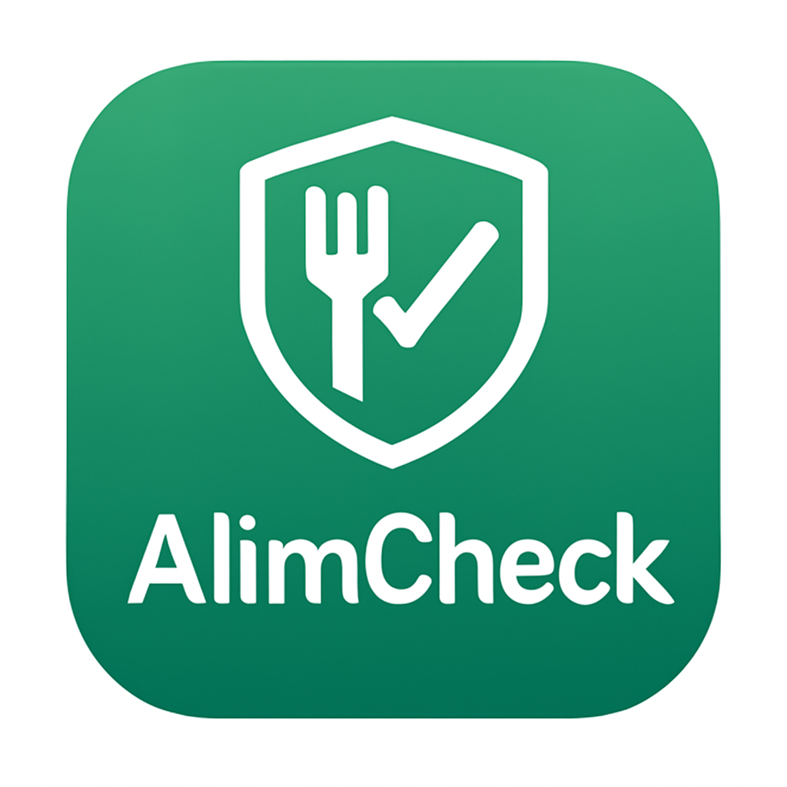

  

---

## 💡 Tema Escolhido

**Segurança Alimentar**  
Aplicativo voltado para melhorar o consumo consciente em Itacoatiara-AM, ajudando os cidadãos a identificar estabelecimentos que realmente sigam boas práticas sanitárias.

---

## 🚀 Funcionalidades Principais

- Cadastro e visualização de estabelecimentos locais
- Sistema de avaliação com notas e comentários
- Alertas comunitários sobre problemas de higiene
- Filtros de busca por tipo de local, nota e localização
- Interface acessível para usuários com baixa familiaridade digital

---

## 🧠 Design Thinking

O processo de ideação foi conduzido com base em:

- **Golden Circle**: Por quê? Como? O quê?
- **Matriz SWOT**
- **Pesquisa de Soluções Existentes**
- **Personas criadas com HubSpot**
- **Brainstorming colaborativo** no Notion  

---

## 📋 Backlog

Gerenciado com o recurso **GitHub Projects**, estruturado em dois quadros:

- **Backlog do Produto**  
  Prioriza histórias de usuário com critérios de aceitação e regras de negócio.

- **Backlog do Sprint**  
  Organiza as tarefas atribuídas a cada membro.

---

## 📅 Scrum e Organização Ágil

- Planejamento semanal no Notion
- Dailys registradas com:
  - O que fiz ontem?
  - O que farei hoje?
  - Enfrentei algum impedimento?
- Reuniões de Review e Retrospectiva a cada sprint

🔗 [Acessar Dailys no Notion (pendente)](pendente)

---

## 👥 Equipe

| Membro    | Função | Responsabilidades principais |
| --------- | ------ | ---------------------------- |
| Bruno     |Scrum Master |Assegurar que o Scrum está sendo compreendido e praticado; ser facilitador e líder-serviço|
| Carlos    |Developer    |Entregar um incremento funcional do produto ao final de cada Sprint                       |
| Cíntia    |Product Owner|Maximizar o valor do produto e gerenciar o Product Backlog                                |
| Francisco |Developers   |Entregar um incremento funcional do produto ao final de cada Sprint                       |
| Nélio     |Developer    |Entregar um incremento funcional do produto ao final de cada Sprint                       |

---

## 📱 Tecnologias

- **Front-end:** (a definir)
- **Gerenciamento:** GitHub Projects + Notion
- **Modelagem:** Draw.io
- **Documentação:** Markdown

---

## 📈 Resultados Esperados

- MVP funcional para Android
- Interface acessível e intuitiva
- Envolvimento da população local
- Repositório com documentação e artefatos organizados

---

